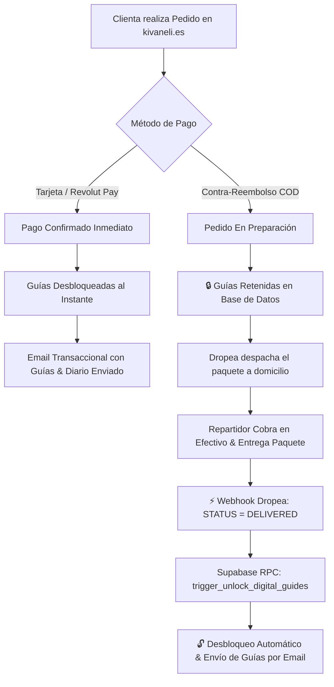

# 🏛️ ARQUITECTURA TÉCNICA, AUTOMATIZACIÓN DE EMAILS, GATING DE GUÍAS Y ESCALABILIDAD — KIVANELI COSMETICS
*Documento Maestro de Arquitectura, Continuidad Operativa y Seguridad Integral para Futuros Agentes / Desarrolladores.*
*Fecha de Emisión: 27 de Agosto de 2026.*

---

## 1. 📋 Resumen del Ecosistema en Producción

* **Dominio Corporativo Principal:** `https://kivaneli.es/` y `https://www.kivaneli.es/`.
* **Alojamiento Edge:** Vercel Global Edge CDN (Proyecto `kivaneli`, Equipo `Architect Project`).
* **Base de Datos & Auth:** Supabase PostgreSQL (Proyecto `sntsizmdhttpilbauxuv`, Región Londres `eu-west-2`).
* **Correo Corporativo Transaccional:** Arsys Correo Pro (`beauty@kivaneli.es`, Servidor `smtp.serviciodecorreo.es:465` SSL/TLS).
* **Operador Logístico:** Dropea Logistics (Madrid, Despacho en 24/48h).
* **Pasarela de Pagos Digitales:** Revolut Pay / Tarjetas Seguras SSL.

---

## 2. 🛡️ Arquitectura de Seguridad & Gating de Entrega Digital (Anti-Fraude y Anti-Bots)

Para proteger el contenido de alto valor y evitar que personas que piden por impulso y rechazan el paquete contra-reembolso se queden con las guías gratuitas, se ha implementado un **motor de entrega condicionada (Gating)**:

### Disparadores Clave en Base de Datos:
1. **`customer_digital_access`**: Tabla con tokens únicos por cliente. Si el pedido es COD, `is_unlocked = false`.
2. **`trigger_unlock_digital_guides(order_number)`**: Función PL/pgSQL ejecutada automáticamente al recibir la confirmación de entrega de Dropea o al validarse manualmente desde el panel `admin.html`.
3. **`verify_coupon(input_code, order_amount)`**: Función RPC protegida con `SECURITY DEFINER`. **Los cupones nunca se exponen al frontend**, impidiendo que bots o IAs maliciosas extraigan listas de códigos.

---

## 3. 📦 Webhook de Dropea Logistics (`/api/dropea-webhook`)

* **Endpoint:** `https://kivaneli.es/api/dropea-webhook` (Método `POST`).
* **Función:** Recibe eventos automáticos desde Dropea Logistics.
  * Si `status == 'DELIVERED'` o `'ENTREGADO'`, actualiza `payment_status = 'PAID'` y desbloquea el acceso a las guías.
  * Si `status == 'IN_TRANSIT'`, actualiza el tracking interno.
  * Si `status == 'RETURNED'`, marca el pedido como no cobrado sin liberar los activos digitales.

---

## 4. 📚 Las 3 Guías Editoriales de Alto Valor (Archivos Locales & Imprimibles)

Ubicación local en el equipo: [`C:\Users\karc0\OneDrive\Desktop\kivaneli\assets\docs\`](file:///C:/Users/karc0/OneDrive/Desktop/kivaneli/assets/docs/)

1. 📖 **[`Guia_Diario_Ritual_30_Dias_Kivaneli.html`](file:///C:/Users/karc0/OneDrive/Desktop/kivaneli/assets/docs/Guia_Diario_Ritual_30_Dias_Kivaneli.html) (36 Páginas Completas):**
   * Psicología del hábito (Bucle Señal-Rutina-Recompensa).
   * Hoja de diagnóstico y foto del Día 1.
   * **30 fichas diarias estructuradas** con listas de verificación de mañana y noche, contador de agua (8 vasos), escala táctil del 1 al 10, notas de sensaciones y frases motivacionales.
   * 4 Hitos semanales (Día 7, 14, 21, 28).
   * Evaluación final del Día 30 con espacio para foto del antes/después y Pase VIP de reposición vitalicio (`VIP20`).

2. 🔬 **[`Guia_Secretos_Fitocosmetica_Kivaneli.html`](file:///C:/Users/karc0/OneDrive/Desktop/kivaneli/assets/docs/Guia_Secretos_Fitocosmetica_Kivaneli.html) (16 Páginas de Tratado Boticario):**
   * Biología del estrato córneo y fisiología de la queratosis pilaris.
   * Madecassoside de Centella Asiática y síntesis de pro-colágeno I y III.
   * Aceite de bayas de Espino Amarillo y Ácido Palmitoleico (Omega-7).
   * Micro-sales osmóticas vs. exfoliantes abrasivos.
   * Despigmentación con Ácido Kójico.
   * Técnica magistral del cepillado en seco (*Dry Brushing*).
   * Los 7 errores comunes en la ducha.

3. 👁️ **[`Guia_Protocolo_Mirada_Radiante_15Min.html`](file:///C:/Users/karc0/OneDrive/Desktop/kivaneli/assets/docs/Guia_Protocolo_Mirada_Radiante_15Min.html) (12 Páginas Perioculares):**
   * Anatomía del párpado y fosa periocular.
   * Diferenciación clínica entre ojeras vasculares, pigmentarias y bolsas de edema.
   * Crioterapia osmótica a 4°C con parches de hidrogel.
   * Los 5 puntos de acupresión linfática (*Zanzhu, Yuyao, Sizhukong, Tongziliao, Chengqi*).
   * Protocolo exprés pre-evento y maquillaje.

---

## 5. ✉️ Correos Transaccionales y Retargeting en Supabase (`email_templates`)

| Slug | Asunto | Disparador | Enlace / Beneficio |
|---|---|---|---|
| `order_confirmation` | ✨ Pedido Confirmado #{{order_number}} | Confirmación Inmediata (Tarjeta) o Post-Entrega Dropea (COD) | Factura Digital + Acceso a las **3 Guías PDF** |
| `abandoned_checkout_recovery` | 🌸 Hemos reservado tu Lote de Piel de Seda | 2h y 24h tras intento de compra | Cupón **SEDA10** (10% DTO) |
| `amiga_welcome_referral` | 💜 ¡Bienvenida al Club de Embajadoras! | Registro en Club Amigas | Enlace `https://kivaneli.es/?ref=...` |
| `amiga_reward_earned` | 🎉 Tu amiga ha completado su pedido | Validación de entrega de referida | Vale de **15,00 €** |
| `post_purchase_checkin_day7` | 🌿 Día 7 con ADEUS™: Tu piel se renueva | 7 días post-entrega Dropea | Consejos de masaje y Diario |
| `winback_promo_30days` | ✨ ¿Se termina tu primer tarro? | 30 días post-entrega Dropea | Cupón **VIP20** (20% DTO) |

---

## 6. 🚀 Próximos Pasos de Integración: Dropea & Revolut Pay

1. **Dropea Logistics:**
   * Enlazar las credenciales API y configurar la URL del Webhook (`https://kivaneli.es/api/dropea-webhook`) en el panel de Dropea para la sincronización automática de estados de entrega.
2. **Revolut Pay:**
   * Incorporar el Merchant API Key de Revolut en el checkout para procesamiento de tarjetas con 1-click checkout y 5% de descuento adicional.
