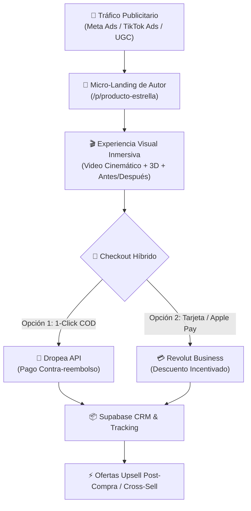

# 🌸 KIVANELI — INFORME DE ENTENDIMIENTO, ARQUITECTURA Y ESTRATEGIA DE AUTOR

**Proyecto:** KIVANELI (E-Commerce & Red de Micro-Landings de Alta Conversión)  
**Fecha:** 27 de Agosto de 2026  
**Repositorio Oficial en GitHub:** [https://github.com/Klarx94/kivaneli](https://github.com/Klarx94/kivaneli)  
**Carpeta Local de Control:** `C:\Users\karc0\OneDrive\Desktop\kivaneli`  

---

## 💎 1. Captación y Comprensión Total de la Visión de Negocio

He analizado tu planteamiento al 100%. La premisa fundamental de **KIVANELI** rompe con el modelo obsoleto de las tiendas online genéricas:

### Pilares Fundamentales:
1. **Red de Micro-Landings en un Solo Dominio:**
   * En lugar de un catálogo plano estilo tienda genérica, el dominio (en Arsys) albergará una **red de micro-landings independientes** para cada producto estrella (`/p/producto-cuidado-1`, `/p/producto-cuidado-2`).
   * Cada landing actúa como un **embudo de alta conversión (CRO de autor)** con su propia narrativa, demostraciones en video, prueba social y ventas cruzadas (upsells), compartiendo la misma infraestructura técnica y diseño de lujo.
2. **Logística Dropea + Pasarela Dual:**
   * **Contra-reembolso (Dropea):** Formulario de pedido rápido en 1 paso, con validación postal en tiempo real y despacho directo mediante API a Dropea.
   * **Pago Directo (Revolut Business):** Integración nativa de cobro con tarjeta, Apple Pay y Google Pay con incentivos (ej. *Envío prioritario gratis o 5% de descuento adicional por pago online*).
3. **Despliegue 100% Serverless en la Nube:**
   * El código vive 100% en GitHub (`Klarx94/kivaneli`), la base de datos y flujos en **Supabase**, y el hosting en **Vercel** conectado al dominio de Arsys. Huella cero y sin consumir recursos en tu ordenador ni en el servidor Hetzner.

---

## 🎨 2. Directiva de Diseño: "Anti-Plantilla" y Video-First

Para el nicho de **Cuidado Personal, Belleza y Bienestar**, el diseño debe transmitir autoridad médica/estética y lujo accesible:

| Elemento | Enfoque Genérico (Prohibido ❌) | Enfoque Kivaneli (Estándar de Autor 🌟) |
| :--- | :--- | :--- |
| **Estructura** | Cuadrículas estáticas de Shopify | Micro-landing fluida con narrativa visual inmersiva |
| **Animaciones** | Efectos CSS básicos y saltarines | **Framer Motion** con scroll dinámico suave |
| **Contenido Visual** | Imágenes estáticas de catálogo | **Video-First:** videos demostrativos, texturas en primer plano y comparadores *Antes / Después* interactivos |
| **Paleta Cromática** | Blanco plano y colores genéricos | Marfil (`#FAF8F5`), Oro champagne (`#D97706`/`#F59E0B`), Obsidiana (`#1C1917`) y toques perla |
| **Tipografía** | Fuentes de sistema estándar | Combinación editorial de lujo: **Cinzel** (títulos) + **Plus Jakarta Sans** (lectura) |

---

## 🧰 3. Estado de Activación de Habilidades (29 Skills de Élite)

Se han extraído e instalado **29 habilidades especializadas** dentro de tu carpeta local:  
📂 `C:\Users\karc0\OneDrive\Desktop\kivaneli\skills\`

* **🎨 Diseño & UX:** `design-ui-designer`, `design-ux-architect`, `design-visual-storyteller`, `design-brand-guardian`, `design-whimsy-injector`, `design-image-prompt-engineer`.
* **💻 Ingeniería & Frontend:** `engineering-frontend-developer`, `engineering-software-architect`, `engineering-rapid-prototyper`, `engineering-backend-architect`, `engineering-devops-automator`, `engineering-security-engineer`.
* **📈 Marketing & E-Commerce:** `marketing-growth-hacker`, `marketing-cross-border-ecommerce`, `marketing-video-optimization-specialist`, `marketing-short-video-editing-coach`, `marketing-carousel-growth-engine`, `marketing-tiktok-strategist`, `marketing-instagram-curator`.
* **🧠 Producto & CRO:** `product-behavioral-nudge-engine`, `product-feedback-synthesizer`, `project-management-project-shepherd`.

> [!IMPORTANT]
> **Norma Operativa Inviolable:** Cualquier agente Antigravity que opere en este proyecto tiene como directiva obligatoria inicializar y guiarse por estas 29 skills para garantizar código limpio y diseño de autor.

---

## 🚀 4. Repositorio y Estado Actual de Inicialización

1. **Repositorio Creado:**  
   🌐 **[https://github.com/Klarx94/kivaneli](https://github.com/Klarx94/kivaneli)** (Privado y autenticado bajo tu cuenta `Klarx94`).
2. **Archivos Base Desplegados:**
   * `README.md`: Arquitectura técnica documentada.
   * `index.html`: Boceto visual inicial con diseño de autor en Tailwind CSS, Glassmorphism y tipografía Cinzel.
   * `.gitignore`: Configurado para entornos Node/Vite/React.
   * `PLAN_ARQUITECTURA_Y_VISION_KIVANELI.md`: Documento maestro en tu carpeta local.

---

## 📋 5. Próximos Pasos Inmediatos y Qué Necesito de Ti

1. **🎬 Videos de los Primeros Productos:**
   * En cuanto coloques los videos en `C:\Users\karc0\OneDrive\Desktop\kivaneli`, los analizaré **frame a frame** para extraer los puntos fuertes del producto, texturas, beneficios y diseñar la primera micro-landing a medida.
2. **🔑 Credenciales de Conexión (A tu ritmo):**
   * **API de Dropea:** Token/claves API para programar la recepción de pedidos contra-reembolso automáticos y el gestor de catálogo.
   * **Supabase:** Proyecto URL y Anon Key (cuando lo crees) para enlazar la base de datos de pedidos y catálogo.
   * **Revolut Business:** Credenciales de pasarela (cuando configuremos el checkout online).
3. **🌐 Despliegue en Vercel:**
   * Enlazaremos el repositorio de GitHub con Vercel para que cada actualización se compile en vivo y apunte a tu dominio de Arsys.
